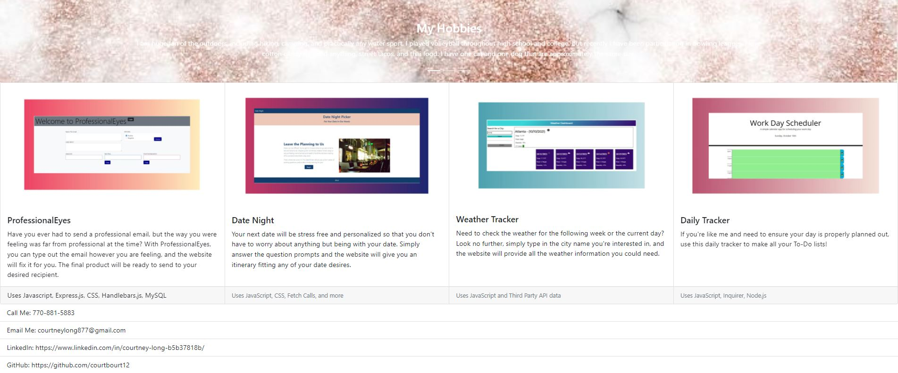

# Awesome Portfolio
---
## Description
My portfolio is going to teach me how to use more interactive Bootstrap content, SPA page design, and push myself to learn more in-depth programming concepts on my own. I want to make my portfolio fun, interactive, and colorful to reflect some of my personality within it. This portfolio will be media responsive so it is easily viewed on different screen sizes.

<a href="https://courtbourt12.github.io/CourtneyMadeAnAwesomePortfolio/">Click here to go to the deployed project</a>

 
 

 
 

## Table of Contents
    - Installation
    - Usage
    - License
    - Contributing
    - Tests
    - Questions

## Installation
Just click on the deployed link to view.

## Usage
Look around, look at life.

## License
license used : MIT License

 

<a href="https://opensource.org/licenses/MIT">Click here for license info.</a>

## Contributing
Courtney Long

## Tests

N/A

 

--- 

 

## Questions

If you have any questions, feel free to contact me:
<ul>
<li> Github : <a href="https://github.com/courtbourt12">Click here to go to my GitHub page.</a> </li>
<li> Email : courtneylong877@gmail.com </li>
</ul>

